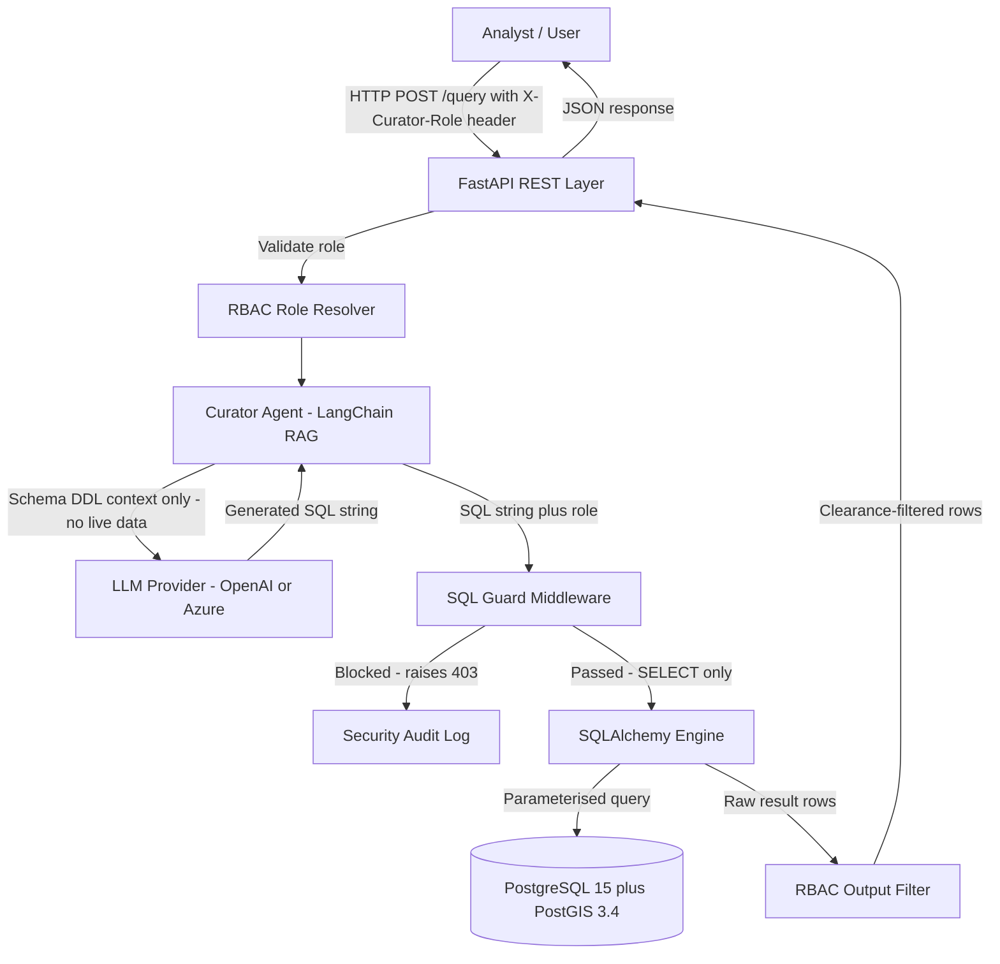
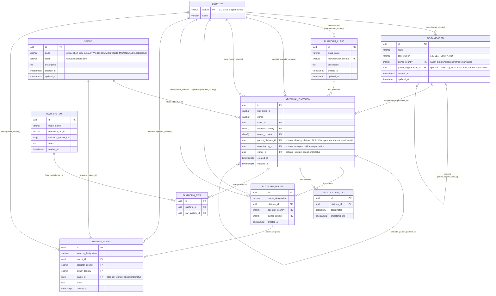
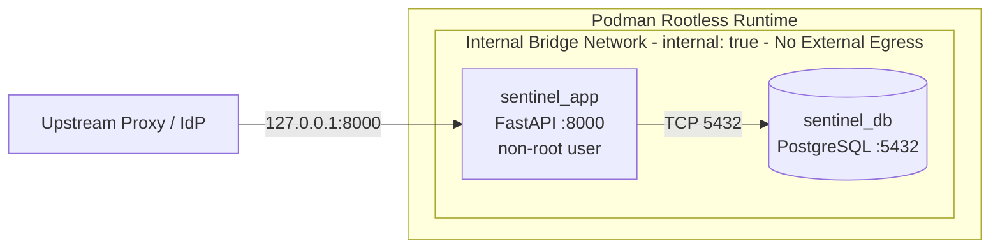

# Sentinel Curator -- Architecture Document

**Version:** 0.1.5
**Date:** 2026-03-25
**Status:** Draft
**Classification:** UNCLASSIFIED // DEVELOPMENT

---

## 1. Overview

Sentinel Curator is a four-layer system combining a PostgreSQL/PostGIS relational database,
a Python FastAPI REST interface, a LangChain RAG (Retrieval-Augmented Generation) agent,
and a strict RBAC output filter. Its primary purpose is to allow authorised analysts to
query military asset data in natural language without direct database access.

---

## 2. System Architecture

---

## 3. Component Descriptions

### 3.1 FastAPI REST Layer
- Entry point for all user queries.
- Reads caller role from the X-Curator-Role HTTP header.
- Validates request schema via Pydantic (min/max length, type enforcement).
- Returns structured JSON responses.
- Binds to 127.0.0.1 only -- never exposed directly to the internet.
- Source: src/sentinel_curator/api/main.py

### 3.2 RBAC Role Resolver
- Maps the X-Curator-Role string to a ClearanceLevel enum value (0, 1, or 2).
- Unknown roles default to UNCLASSIFIED (deny-by-default).
- Three tiers: UNCLASSIFIED (0) -- RESTRICTED (1) -- CONFIDENTIAL (2).
- Source: src/sentinel_curator/rbac/roles.py

### 3.3 Curator Agent
- LangChain-based SQL agent.
- Provides the LLM with schema DDL only -- no live data is ever in the LLM context.
- Instructs the LLM to produce only SELECT statements.
- Returns the raw SQL string to the SQL Guard for validation before any execution.
- Source: src/sentinel_curator/curator/agent.py

### 3.4 SQL Guard Middleware
- Extracts the first SQL keyword from the LLM output.
- Blocks INSERT, UPDATE, DELETE, DROP, TRUNCATE, CREATE, ALTER, GRANT, REVOKE, COPY, and others.
- Only SYSTEM_ADMIN and DATA_CURATOR roles may execute write statements.
- Raises SqlGuardViolation on blocked statements -- logged as a security event.
- Independent of the LLM prompt -- cannot be bypassed by prompt injection.
- Source: src/sentinel_curator/curator/sql_guard.py

### 3.5 PostgreSQL 15 + PostGIS 3.4
- Hosted in an isolated Podman container on an internal bridge with internal: true (no external egress).
- UUID v4 primary keys throughout.
- Row-Level Security enabled on all RESTRICTED and CONFIDENTIAL tables.
- Least-privilege service account (curator_app) granted SELECT only.
- A central `country` table (ISO 3166-1 alpha-2) is the single source of truth for all
  `operator_country`, `owner_country`, and `manufacturer_country` values. All such columns
  are foreign keys to `country.alpha2`; free-text country strings are not permitted.
- An `organisation` table represents military organisations (e.g. CENTCOM, 7th Fleet, NATO).
  Each organisation has an owning country, may be subordinate to a parent organisation
  (but cannot reference itself), and individual platforms may be optionally assigned to one.
- A `status` table is the single source of truth for operational status codes
  (e.g. Active, Decommissioned, In Maintenance, Reserve). Both `individual_platform` and
  `weapon_mount` carry an optional `status_id` foreign key to this master table.

### 3.6 RBAC Output Filter
- Post-execution filter strips columns from result rows that exceed the caller's clearance.
- Belt-and-braces layer complementing the SQL Guard.
- Source: src/sentinel_curator/curator/agent.py (_filter_results function)

---

## 4. Data Model

### 4.1 Cardinality Notes

| Relationship | Cardinality | Notes |
|---|---|---|
| COUNTRY to ORGANISATION (owner_country) | One to zero-or-many | A country may own or sponsor no tracked organisations |
| COUNTRY to PLATFORM_CLASS (manufacturer_country) | One to zero-or-many | A country may have manufactured no tracked class |
| COUNTRY to INDIVIDUAL_PLATFORM (operator_country) | One to zero-or-many | A country may operate no tracked platforms |
| COUNTRY to INDIVIDUAL_PLATFORM (owner_country) | One to zero-or-many | A country may own no tracked platforms |
| COUNTRY to PLATFORM_MOUNT (operator_country / owner_country) | One to zero-or-many | Propagated from platform-level nationality |
| COUNTRY to WEAPON_MOUNT (operator_country / owner_country) | One to zero-or-many | Propagated from platform-level nationality |
| ORGANISATION to ORGANISATION (parent_organisation_id) | Zero-or-one to zero-or-many | A military organisation may be subordinate to at most one parent organisation (e.g. NAVCENT under CENTCOM); a parent may contain zero or many subordinate organisations; an organisation cannot be its own parent |
| ORGANISATION to INDIVIDUAL_PLATFORM (organisation_id) | Zero-or-one to zero-or-many | A platform may be assigned to at most one military organisation (e.g. a carrier assigned to 7th Fleet); an organisation may have zero or many assigned platforms |
| STATUS to INDIVIDUAL_PLATFORM (status_id) | One to zero-or-many | A status code may apply to no tracked platforms; a platform has at most one current status (NULL when not set) |
| STATUS to WEAPON_MOUNT (status_id) | One to zero-or-many | A status code may apply to no tracked weapons; a weapon mount has at most one current status (NULL when not set) |
| PLATFORM_CLASS to INDIVIDUAL_PLATFORM | One to zero-or-many | A class may have no physical hulls yet |
| INDIVIDUAL_PLATFORM to INDIVIDUAL_PLATFORM (parent_platform_id) | Zero-or-one to zero-or-many | A platform may be embarked on at most one host platform (e.g. aircraft on a carrier); a host may carry zero or many embarked platforms; a platform cannot be its own parent |
| INDIVIDUAL_PLATFORM to PLATFORM_MOUNT | One to zero-or-many | A platform may have no tracked mounts |
| PLATFORM_MOUNT to WEAPON_MOUNT | One to zero-or-many | A mount may be empty |
| INDIVIDUAL_PLATFORM to RWR_SYSTEM | Many to many via PLATFORM_RWR | A platform carries zero, one, or many RWR systems; a model may be on many platforms |
| INDIVIDUAL_PLATFORM to GEOLOCATION_LOG | One to zero-or-many | Telemetry is time-series; may be absent for new platforms |

---

## 5. Container Architecture

---

## 6. Classification Tier Summary

| Layer | UNCLASSIFIED | RESTRICTED | CONFIDENTIAL |
|---|---|---|---|
| Platform class names and descriptions | Visible | Visible | Visible |
| Platform telemetry / GPS coordinates | Hidden | Visible | Visible |
| Weapon mounts and designations | Hidden | Hidden | Visible |
| RWR Emitter-ID exclusion lists | Hidden | Hidden | Visible |

---

## 7. Technology Stack

| Component | Technology | Version |
|---|---|---|
| Language | Python | 3.11+ |
| Web framework | FastAPI | 0.110+ |
| ORM | SQLAlchemy | 2.0+ |
| Data validation | Pydantic | 2.6+ |
| Database | PostgreSQL | 15 |
| Spatial extension | PostGIS | 3.4 |
| LLM orchestration | LangChain | 0.1+ |
| Containerisation | Podman rootless | 4.x |
| Logging | structlog | 24.x |

---

## 8. Sources

| Reference | URL |
|---|---|
| LangChain SQL Agents | https://python.langchain.com/docs/use_cases/sql/ |
| PostGIS documentation | https://postgis.net/documentation/ |
| SQLAlchemy 2.0 | https://docs.sqlalchemy.org/en/20/ |
| FastAPI | https://fastapi.tiangolo.com/ |
| Podman rootless | https://github.com/containers/podman/blob/main/docs/tutorials/rootless_tutorial.md |
| ISO 3166-1 country codes | https://www.iso.org/iso-3166-country-codes.html |
