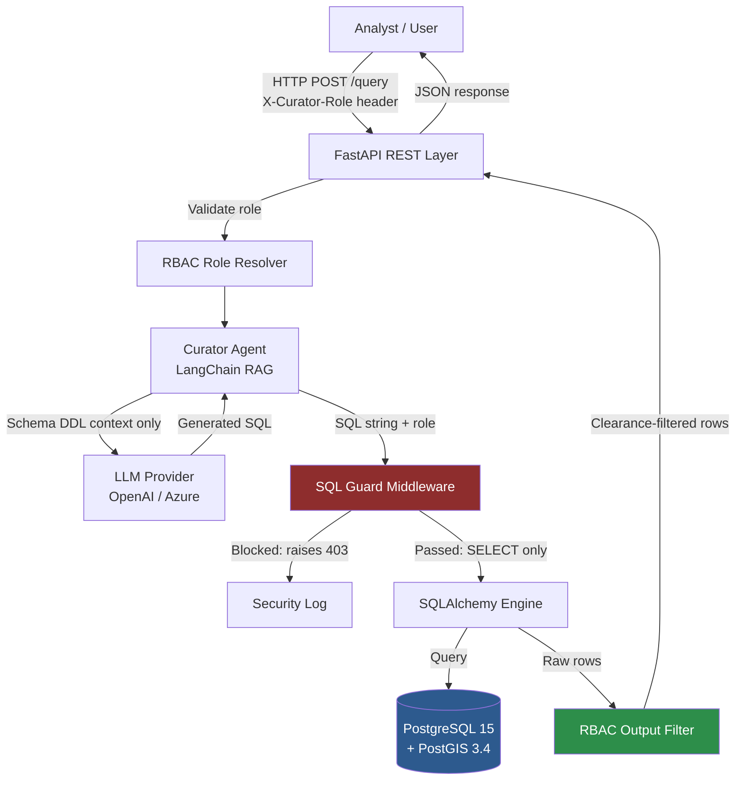
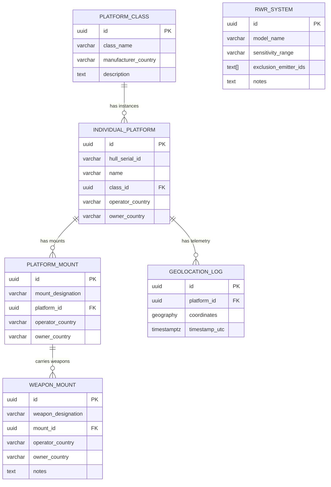
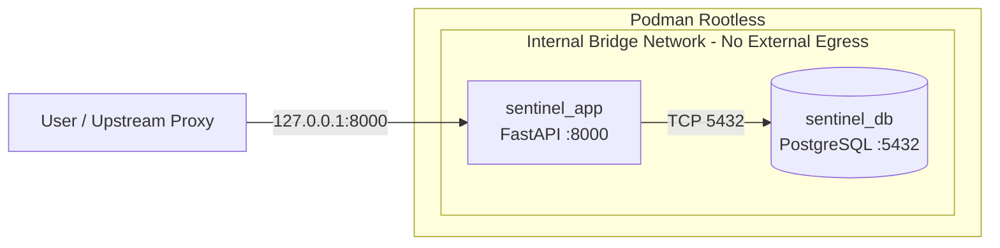

# Sentinel Curator — Architecture Document

**Version:** 0.1.0  
**Date:** 2026-03-25  
**Status:** Draft  
**Classification:** UNCLASSIFIED // DEVELOPMENT

---

## 1. Overview

Sentinel Curator is a four-layer system combining a PostgreSQL/PostGIS relational database, a Python FastAPI REST interface, a LangChain RAG (Retrieval-Augmented Generation) agent, and a strict RBAC output filter. Its primary purpose is to allow authorised analysts to query military asset data in natural language without direct database access.

---

## 2. System Architecture

---

## 3. Component Descriptions

### 3.1 FastAPI REST Layer
- Entry point for all user queries.
- Reads caller role from the `X-Curator-Role` HTTP header.
- Validates request schema via Pydantic.
- Returns structured JSON responses.
- Binds to `127.0.0.1` only (or container loopback) — never exposed directly to the internet.

### 3.2 RBAC Role Resolver (`rbac/roles.py`)
- Maps the `X-Curator-Role` string to a `ClearanceLevel` enum value.
- Unknown roles default to `UNCLASSIFIED` (deny-by-default principle).
- Three tiers: `UNCLASSIFIED (0)` → `RESTRICTED (1)` → `CONFIDENTIAL (2)`.

### 3.3 Curator Agent (`curator/agent.py`)
- LangChain-based SQL agent.
- Provides the LLM with **schema DDL only** — no live data is ever included in the LLM context. This prevents data exfiltration via the LLM.
- Instructs the LLM to generate only `SELECT` statements.
- Returns the raw SQL string to the SQL Guard for validation.

### 3.4 SQL Guard Middleware (`curator/sql_guard.py`)
- Extracts the first SQL keyword from the LLM-generated string.
- Blocks any statement that is not `SELECT` unless the caller holds a write-permitted role (`SYSTEM_ADMIN`, `DATA_CURATOR`).
- Raises `SqlGuardViolation` on blocked statements — logged as a security event.
- This is a hard enforcement layer independent of the LLM prompt.

### 3.5 PostgreSQL 15 + PostGIS 3.4
- Hosted in an isolated Podman container on an internal bridge network with `internal: true` — no external egress.
- UUID v4 primary keys throughout.
- Row-Level Security (RLS) enabled on all sensitive tables.
- Least-privilege service account (`curator_app`) granted `SELECT` only.

### 3.6 RBAC Output Filter
- Post-execution filter strips columns from result rows that are above the caller's clearance.
- Belt-and-braces layer — the primary guard is the SQL Guard, but this layer ensures no column leaks even if a SELECT is crafted to return sensitive columns.

---

## 4. Data Model

---

## 5. Container Architecture

---

## 6. Security Architecture Summary

| Control | Implementation |
|---|---|
| No external DB access | Podman `internal: true` network |
| SQL injection prevention | SQL Guard middleware + parameterised queries |
| LLM data exfiltration prevention | Schema DDL context only — no live data in LLM prompt |
| Enumeration prevention | UUID v4 primary keys |
| Least privilege | `curator_app` has SELECT only |
| RBAC tiering | Three-tier clearance model with output column filtering |
| Secrets management | Environment variables / `.env` — never in source |
| Structured audit logging | structlog JSON to stdout — SIEM-ingestible |

---

## 7. Technology Stack

| Component | Technology | Version |
|---|---|---|
| Language | Python | 3.11+ |
| Web framework | FastAPI | 0.110+ |
| ORM | SQLAlchemy | 2.0+ |
| Data validation | Pydantic | 2.6+ |
| Database | PostgreSQL | 15 |
| Spatial extension | PostGIS | 3.4 |
| LLM orchestration | LangChain | 0.1+ |
| Containerisation | Podman (rootless) | 4.x |
| Logging | structlog | 24.x |

---

## 8. Sources

| Reference | URL |
|---|---|
| LangChain SQL Agents | https://python.langchain.com/docs/use_cases/sql/ |
| PostGIS documentation | https://postgis.net/documentation/ |
| SQLAlchemy 2.0 docs | https://docs.sqlalchemy.org/en/20/ |
| FastAPI docs | https://fastapi.tiangolo.com/ |
| Podman rootless tutorial | https://github.com/containers/podman/blob/main/docs/tutorials/rootless_tutorial.md |
